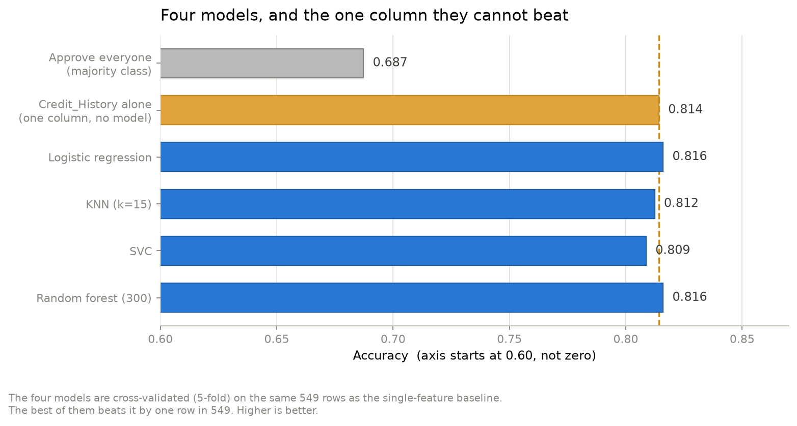
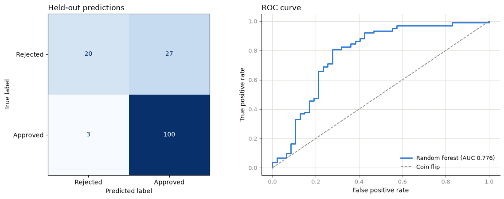
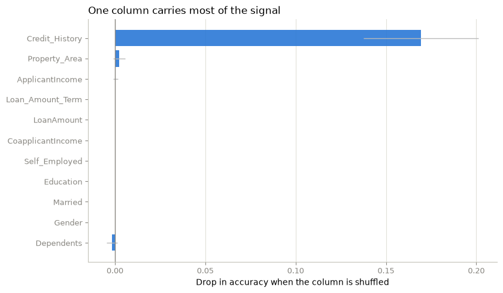

# Loan Approval Prediction

Predicting whether a loan application is approved, from a 598-row dataset of
applicant records — and reporting honestly on how little of that prediction is
actually being done by the model.



## The short version

**No model here beats a single column.** `Credit_History` — one field, no
model, approve if the applicant has a repayment history — scores **81.4%**.
Four properly cross-validated classifiers, with imputation, one-hot encoding
and scaling, land between 80.9% and 81.6%. Measured on the same 549 rows, the
best of them beats the single column by **one row in 549**.

That is the finding, and it is the reason this repo is worth more than the
accuracy table it replaces. The original version of this notebook compared four
models against each other and against nothing else.

## Results

5-fold stratified cross-validation over all 598 rows, plus a head-to-head on
the 549 rows where `Credit_History` is known:

| Model | Accuracy (598 rows, 5-fold CV) | ROC-AUC | Accuracy (549 rows, head-to-head) |
|---|---|---|---|
| Credit_History alone *(baseline)* | — | — | **0.814** |
| Logistic regression | 0.809 ± 0.023 | 0.759 | 0.816 |
| Random forest (300) | 0.804 ± 0.022 | 0.759 | 0.816 |
| KNN (k=15) | 0.809 ± 0.019 | 0.738 | 0.812 |
| SVC (RBF) | 0.799 ± 0.020 | 0.753 | 0.809 |
| Approve everyone *(baseline)* | 0.687 | — | — |

The head-to-head column is the fair comparison: same 549 rows for the baseline
and for every model. The best model wins by 0.0018 — one row.

On a 25% held-out test set the random forest reaches 0.800 accuracy, against a
majority-class baseline of 0.687. That gap looks like a result until you notice
its recall on rejected applications is **0.426**: it misses more than half the
applications it should have flagged.

## Why the accuracy is misleading



ROC-AUC sits near 0.76 while accuracy sits near 0.81. If the model discriminated
between good and bad applicants those two would move together. They don't,
because the accuracy is coming from the class imbalance rather than from
discrimination.

The confusion matrix is the clearest statement of it. Of 47 applications that
were actually rejected, the model catches 20 and misses 27 — a recall of 0.426.
It predicts "approved" for 127 of 150 held-out applications (85%), and on a
dataset that is 68.7% approved that is a cheap way to look competent. If
rejections are the costly mistake, this model is not fit for the job regardless
of its accuracy; if approvals are, it could be replaced by a lookup on one
column.

## Where the signal is



Permutation importance on held-out rows, which answers the question the
original's correlation heatmap was reaching for without its flaw — it measures
what each column contributes to the predictions, rather than correlating
label-encoded categories whose codes are arbitrary.

`Credit_History` dominates. Everything else is at or below zero, meaning
shuffling those columns does not hurt the model at all — it is not using them.

## What was wrong with the original

| Problem | Consequence |
|---|---|
| Every column mean-imputed, before the split | `Credit_History` (a 0/1 flag, 49 missing) became **0.84**; `Dependents` became **0.756**. Impossible values, plus leakage from the test set. |
| `LabelEncoder` on nominal columns | Invented the ordering Rural < Semiurban < Urban, which every model then treated as real. |
| No feature scaling | `ApplicantIncome` in tens of thousands vs `Credit_History` in 0/1 — the SVC collapsed to the majority class (68.7%) and KNN (63.8%) fell *below* it. |
| `RandomForestClassifier(n_estimators=7)` | 98.0% train vs 82.5% test. That 15-point gap is pure overfitting, reported as a result. |
| Single 60/40 split, `random_state=1`, no stratification | One number per model, no variance, no way to tell real differences from noise. |
| No baseline of any kind | The 81.4% single-column baseline was never computed, so none of the four models was ever compared against the thing that matters. |

## What's in here

```
Loan Approval Prediction.ipynb   the analysis, executed with outputs
LoanApprovalPrediction.csv       dataset (598 x 13)
model_vs_baseline.png            README chart — models vs. the single column
feature_importance.png           export of the permutation importance cell
confusion_and_roc.png            export of the confusion matrix / ROC cell
requirements.txt
```

The two `feature_importance` / `confusion_and_roc` images are byte-identical
extracts of the notebook's own cell outputs, not re-rendered copies.

**Method.** `ColumnTransformer` + `Pipeline` with mode imputation for the flag
and the count, median for the amounts, one-hot encoding for nominal columns and
`StandardScaler` for the rest — all fitted inside each cross-validation fold, so
no fold is scored on data it was fitted on. `StratifiedKFold(5, shuffle=True,
random_state=42)`, reporting accuracy, precision, recall, F1 and ROC-AUC.
Everything is seeded, so the notebook and the chart above agree.

## Running it

```bash
pip install -r requirements.txt
jupyter notebook "Loan Approval Prediction.ipynb"
```

## What this dataset supports, and what it does not

**598 rows.** Cross-validated standard deviations run to about 0.02, so
differences of a point or two between these models are noise. Ranking four
models on a single split, as the original did, is not evidence of anything.

**Approval is not repayment.** The target records whether a loan was *approved*,
not whether it was *repaid*. A model trained on it reproduces the biases in the
original decisions and cannot say whether those decisions were good. This is the
central limitation, and no amount of tuning addresses it.

**Accuracy is the wrong objective.** Approving a defaulter and rejecting a
creditworthy applicant are not equally costly, and a threshold chosen to
maximise accuracy is not chosen to minimise either one. A usable version would
need the real repayment outcome, an explicit cost per mistake, and a threshold
picked against that cost — at which point `Credit_History` may well still be
the right answer, but it would at least be a *reasoned* one.
